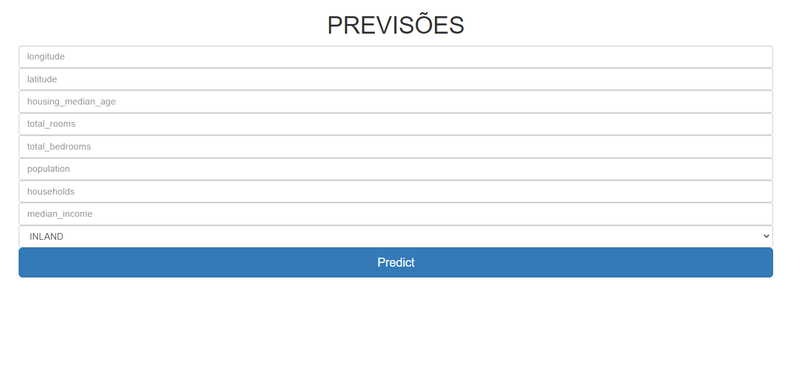
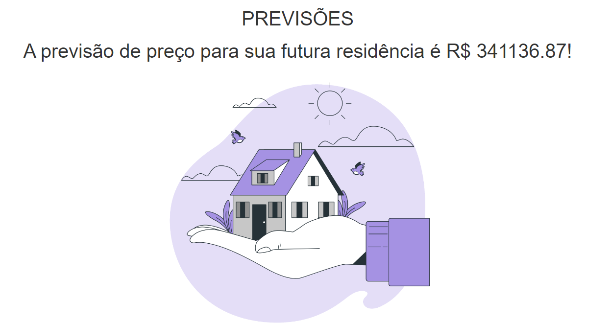

# Objetivo do repositório

Este repositório tem como objetivo criar uma aplicação web com flask e railway com um modelo simples de aprendizado de máquina.

## Uma prévia do aplicativo

### Interface inicial

### Interface de resultados

Link da aplicação => https://newdeploy-production-4cd1.up.railway.app/predict   

# Explicação dos arquivos:

- 'app.py' - Arquivo principal de execução do app flask.
- 'info_apoio.py' - Funções auxiliares.
- 'Procfile' - Arquivo responsável pela deploy do modelo.
- 'requirements.txt'- Requisitos responsáveis pela instalação do repositório.

Pastas:

- 'models/' - 'Arquivos .pkl'
- 'static/' - 'Arquivos de interface front-end'
- 'templetes/' - 'Arquivos .html'

# Ferramentas utilizadas

- Python 3.7.9 - (https://www.python.org/downloads/release/python-379/)
- Bootstrap - (https://getbootstrap.com/)
- Railway - (https://railway.app/)
- HTML 5
- Java

# Principais bibliotecas utilizadas (Python 3.7.9)

- os (interna)
- joblib (https://joblib.readthedocs.io/)
- pandas (https://pandas.pydata.org/)
- numpy (https://numpy.org/)
- flask (https://flask.palletsprojects.com/)

# CONTATO PROFISSIONAL

- Linkedin: https://www.linkedin.com/in/santana-leandro/
- Email: leandro09@unifei.edu.br
